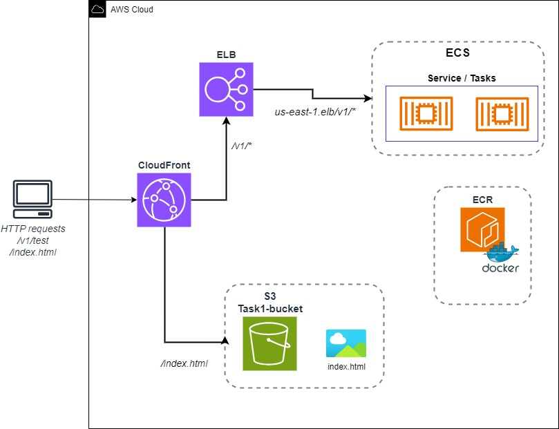

# Task 1 - API application

## Overview

This task covers basic code writing capabilities and cloud infrastructure knowledge. 
The task include creating application to answer basic api calls and be implemented in AWS cloud.

The following items were included:

:white_check_mark: A Node.js application including index.js file that contains the following routes:
    * GET /v1/test - returns “This is Scopio Labs” message and a 200 status code.  
    * GET /v1/health - returns "I am alive..." with a 200 status code.    
:white_check_mark: The application was dockerized with a configurable port and hostname through env vars.  
:white_check_mark: The docker image was uploaded to ECR and assigned to a new registry.  
:white_check_mark: ECS cluster created, with service and tasks, deploying the application over us-east-1.  
:white_check_mark: Using Cloudfront, a distribution created with two Origins to route all requests containing /v1 to the ECS cluster, while all other requests provided from an
S3 bucket.  
:white_check_mark: The application made highly available based on the /v1/health route.

## System architecture

the diagram below represent the main AWS resources used and traffic flow:


Above AWS Architecture Diagram showing how deploy Serverless Containerized Application on Amazon ECS Fargate with services and tasks and the route made by CloudFront service to direct the traffic either to the ECS and API application or to the html file stored in S3 bucket.  
All AWS resource, except S3 and CloudFront were deployed with the Copilot tool.

### What is Amazon ECR and ECS?
Amazon Elastic Container Registry (Amazon ECR) is a fully managed container registry offering high-performance hosting, so you can reliably deploy application images and artifacts anywhere.

Amazon ECS is a fully managed container orchestration service that makes it easy for you to deploy, manage, and scale containerized applications.

### What is AWS Fargate?
AWS Fargate is a serverless, pay-as-you-go compute engine that lets you focus on building applications without managing servers. AWS Fargate is compatible with both Amazon Elastic Container Service (ECS) and Amazon Elastic Kubernetes Service (EKS).

### What is AWS Copilot?
The AWS Copilot CLI is a tool for developers to build, release, and operate production-ready containerized applications on Amazon ECS, AWS Fargate and AWS App Runner. 
From getting started, pushing to staging, and releasing to production, Copilot can help manage the entire lifecycle of your application development. 

AWS Copilot helps customers focus on building their applications rather than setting up their infrastructure. With one command, AWS Copilot will provision all the infrastructure customers need to run production-ready containerized services on Amazon ECS and AWS Fargate.
The tool helps to apply AWS best practice and reduce human errors.

AWS Copilot will create ECS clusters, tasks, services for Fargate launch types along with that also create load balancers, VPC, ECR registries, and more.

### What is CloudFront?
Amazon CloudFront is a web service that speeds up distribution of your static and dynamic web content, such as .html, .css, .js, and image files, to your users. CloudFront delivers your content through a worldwide network of data centers called edge locations. When a user requests content that you're serving with CloudFront, the request is routed to the edge location that provides the lowest latency (time delay), so that content is delivered with the best possible performance.


For this task, a distribution resource created with two origen sources, one for the S3 bucket (serve the index.html file) and another to the ALB which send the request to the ECS and API application. The distribution defined with several behaviors to correctly router the requests.

## Execution activities

The following actions were made as part of this task:

1) Use Node.js method to create the platform for the API application. 
   Together with the Express package.  

    ``` js

    const express = require("express");
    const app = express();

    app.get("/", (req, res) => {
      res.send("");
      console.log("access log: GET, /");
    });

    app.get("/v1/test", (req, res) => {
      res.send("This is Scopio Labs - testing");
      console.log("access log: GET, v1/test");
    });

    app.get("/v1/health", (req, res) => {
      res.send("I am alive...");
      console.log("access log: GET, v1/health");
    });

    app.listen(8080, () => {
      console.log("Server is Ready. Listening...");
    });

    ```
  
2) Create a Docker file with the following content to create the image.
  
     
     ``` yaml
     FROM node:alpine

     WORKDIR /app
     COPY package.json .
     
     RUN npm install
     
     COPY . .
     
     EXPOSE 8080
     
     CMD [ "node", "index.js" ]


     ```
   
3) At this point we could use Copilot tool to initialize the environment, build the docker image, upload it to the ECR and deploy the application in ECS.
At the end of the process the infrastructure was ready with the Docker image imported into the ECR, service and tasks defined in ECS and application load balancer could get accept the requests directed to the API application.


4) S3 bucket created with public access restriction. And the index.html file uploaded to the bucket under specific directory /web.
5) CloudFront distribution created with two origins: ALB and S3.
The S3 bucket policy was updated to allow Cloudfront distribution to access the S3 resource. 
Cloudfront behavior definition direct each request the the correct origan: /index.html to the S3 bucket, /v1/* to the ECS  

The images below provides a snapshot of the different requests.


[index request](https://d1ys7mmnt8oodh.cloudfront.net/index.html)


[test request](https://d1ys7mmnt8oodh.cloudfront.net/v1/test)


[health request](https://d1ys7mmnt8oodh.cloudfront.net/v1/health)


