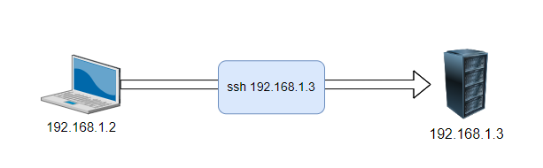
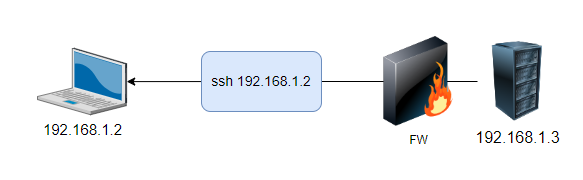
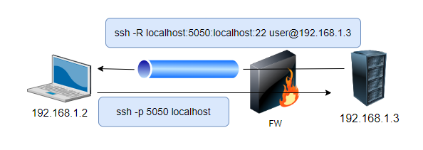
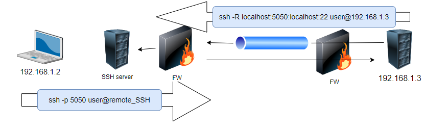
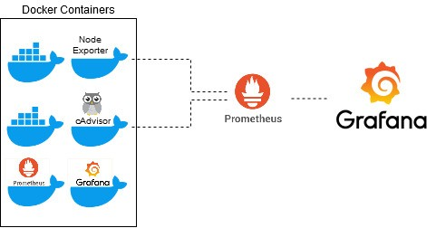

# Task 2 - Solution Architecture

- [Task 2 - Solution Architecture](#task-2---solution-architecture)
  - [1. Overview](#1-overview)
  - [2. Objective:](#2-objective)
  - [3 Document Overview:](#3-document-overview)
  - [4. Connectivity Solutions](#4-connectivity-solutions)
    - [4.1 Reverse SSH](#41-reverse-ssh)
    - [4.2 Improvement suggestions](#42-improvement-suggestions)
    - [4.3 Alternative options](#43-alternative-options)
  - [5. Software Upgrades.](#5-software-upgrades)
    - [5.1 System considerations.](#51-system-considerations)
    - [5.2 SW upgrade System Architecture:](#52-sw-upgrade-system-architecture)
    - [5.3 Considerations:](#53-considerations)
    - [5.4 Improvement options](#54-improvement-options)
  - [6 Logs collection and telemetry data](#6-logs-collection-and-telemetry-data)
    - [6.1 Logs Collection:](#61-logs-collection)
    - [Telemetry Data:](#telemetry-data)


## 1. Overview

The main goals in this task is to provide an outline of the HLD document including schematics, system connectivity and flow of information for technical solutions. 

## 2. Objective:

The document propose an open source based solution that can provide the following functionality:

1. Remote connection to the machine in isolated environment (direct incoming connections are not allowed).
2. SW update of custom software packages (packages download should be
allowed only from company’s devices, server side and client side should be
mutually authenticated).
3. Collection of logs and telemetry data.


## 3 Document Overview:

The document covers a solution that takes these consideration in mind:
1) Implementation simplicity.
2) Relay on native Linux OS functionality.
3) Consider security aspects.
4) Allow scaling and multiple clients support.

The document will cover technical applicable solution suggestion, but also methods for improvements that can include third party applications.


## 4. Connectivity Solutions 

Several solutions could be suggested for remote connection system.
In this section we specified different options. Starting with the most simple one and with the lowest cost, and others which are much more robust and can support large number of devices.

### 4.1 Reverse SSH 
One of the option to use is ssh with reverse connection option.
SSH is one of the most used network protocol for interacting with remote servers and computers. However, in some cases, SSH access to a specific host can be blocked due to firewalls or other network settings.

For example here is a simple scenario where we want to SSH into a given server. 
For this example, the IP of this server is 192.168.1.2 while that our computer is 192.168.1.3.



In the absence of any constraint, this can be achieved trivially with the basic SSH command:

``` bash
user@client $ ssh user_name@192.168.1.3
```

In our situation, for example, we want to connect with a device, that can run ssh. 
The device will act as a server and with IP 192.168.1.3. It will sits behind a firewall that blocks inbound traffic on all ports. 
SSH connection attempts from 192.168.1.2 will be blocked.
Still, we assumed the server does not have limitation on the outbound connectivity and it has internet connectivity.
Firewall are often configured asymmetrically, blocking traffic in one direction but not the other. Thus, it would not be unnatural that 192.168.1.3 can connect to other hosts via SSH even itself is to reachable.



Although not possible by default, an SSH connection can actually be configured to allow reverse connections using the -R flag.

The parameters of the -R flag take the following form: 
\<host on destination\>:\<port on destination\>:\<host on origin\>:\<port on origin\>

For our scenario, we want an SSH connection into 192.168.1.3 itself so \<port on origin\> is set to 22 while \<host on origin\> can just be set to localhost. 
On the other hand we want our computer to be able to connect to 192.168.1.3 using a port of our choice, \<port on destination\>. Here 5050 is used as an example and is thus opened on 192.168.1.2 itself. 
Our computer will use port 5050 opened on itself to access 192.168.1.3 and thus \<host on destination\> is set to localhost.
Here is how the command would look for this example:

```bash
user@server > ssh -R localhost:5050:localhost:22 user@192.168.1.3
```

With such connection established, 192.168.1.2 can use the chosen port, i.e. 5050, to connect to 192.168.1.3.

```bash
user@client > ssh -p 5050 localhost
```



Since we want to support multiple connectivity from several devices, it would be better to use a dedicated ssh gateway server for this task, allowing many devices to be connected. 
The remote gateway can be installed in the cloud or in a local data-center.
It should have a public IP and option to allow connection in a specific port range. 

The operator admin should have the abilities to manage the ports assigned to the remote gateway and to have the capabilities to synchronize the assigned port with the distance devices.



We want to allocate port 5050 of the gateway so that local users can use it to SSH into 192.168.1.3. To achieve this, we SSH from 192.168.1.3 into the remote gateway IP (public) using the -R flag but this time, the host on destination option mentioned earlier is set to 0.0.0.0. 
This implies that the destination allows any host to connect on the given port, here 5050.

In order to allow 192.168.1.2 (a host external to the remote gateway) to use port 5050 for connection, the gateway’s SSH server needs to be configured appropriately. 
This is done by editing the `/etc/ssh/sshd_config` file and removing the comment at the line that says `GatewayPorts yes` as suggested below:

```bash
...
#AllowTcpForwarding yes
GatewayPorts yes
X11Forwarding yes
...
```

With this done, our machine can now use the connection between the target and the gateway in reverse using the following command:

```bash

user@client > ssh -p 5050 user@<remote_gw_ip>

```

### 4.2 Improvement suggestions

There are several ways to establish the remote connection:

1) A predefined script could be made on the remote device (e.g 192.168.1.3).
When there is a need for support engineer to connect to the device it can asked to run the script. The script will include the execution command to establish the connection.

2) To improve security, we could use ssh key-pairs that will be shared between the device and the remote gateway. In that way we could prevent using password. The public key of the device will be copy to the remote gateway with the commands `sshpass` and `ssh-copy-id`

3) Instated of running script on the device, it is possible to define service that would start with the system boot.
It would be much preferable if this connection existed as a service that automatically restarts whenever it fails.

To achieve this, we can write a simple service file for SystemD and just enable it for automatic start on boot.

For example, one can create a file called reverse_shell.service in /etc/systemd/system with the following content:

```bash
[Unit]
Description="Reverse SSH"
After=network.target
[Service]
User=<USER_NAME>
Restart=always
RestartSec=10s
ExecStart=/usr/bin/sshpass -p "YOUR_PASSWORD" \
    ssh -N \
    -R 0.0.0.0:5050:localhost:22 \
    -o ExitOnForwardFailure=yes \
    -o ProtocolKeepAlives=5 \
    <REMOTE_GW_IP>
[Install]
WantedBy=multi-user.target
```

4) The remote gateway could be dockerize so that each device will use different container.

### 4.3 Alternative options

**tmate**

Another tool that follow the same concept but is limited to an ad-hoc connectivity it [tmate.io](https://tmate.io/).
tmate is an instance terminal sharing. 
It allows others to join your terminal session. All users see the same terminal content at all time. This is useful for pair programming where two people share the same screen, but have different keyboards.

tmate is useful as it goes through NATs and tolerate host IP changes. Accessing a terminal session is transparent to clients as they go through the tmate.io servers, acting as a proxy. No authentication setup is required, like setting up ssh keys.

tmate also allow you to share a read-only view of your terminal. The read-only connection string can be retrieved with tmate show-messages.

It is possible to run a local tmate server with [tmate docker server](https://hub.docker.com/r/tmate/tmate-ssh-server).
Another option is to used tmate with API keys for controlling the assigned username and session id.

**Boundary**
[HashiCorp Boundary](https://developer.hashicorp.com/boundary) is a simple and secure remote access. An identity-aware proxy aimed at simplifying and securing least-privileged access to your infrastructure.

With Boundary you can:

* Integrate with your IdP of choice using OpenID Connect, enabling users to securely sign-in to their Boundary environment.
* Provide just-in-time network access to network resources, wherever they reside.
* Manage session credentials via a native static credential store, or dynamically generate unique per-session credentials by integrating with HashiCorp Vault.
* Automate discovery of new endpoints.
* Manage privileged sessions using Boundary’s session controls.
* Standardize your team's access workflow with a consistent experience for any type of infrastructure across any provider.

More information could be found [here](https://developer.hashicorp.com/boundary/docs/overview/what-is-boundary) and in the [github project](https://github.com/hashicorp/boundary).


## 5. Software Upgrades.

### 5.1 System considerations.

When designing software upgrades process, there are several considerations to keep in mind to ensure a smooth and efficient process. Here are some key factors to consider:

* Modularity and Versioning:
  Design the software in a modular fashion, where components can be updated independently.
  Implement versioning for both the entire system and individual modules/components. This helps in tracking changes and managing dependencies.

* Compatibility:
  Ensure backward compatibility with older versions of the software to avoid disruptions for existing users.
  Clearly communicate any breaking changes and provide migration paths for users to update their systems accordingly.
  
* Rollback Mechanism:
  Include a rollback mechanism that allows users to revert to the previous version in case the upgrade causes issues. This helps mitigate risks associated with unforeseen problems.

* Deployment Strategy:
  Choose an appropriate deployment strategy, whether it's a phased rollout, canary release, or a complete system update. Consider the impact on users and the system's availability during the deployment.

* Backup and Recovery:
  Perform regular backups before initiating any upgrade to ensure data safety. Have a robust recovery plan in case the upgrade process fails.
* Security Considerations:
  Prioritize security during the upgrade process. Ensure that the new software version addresses any known vulnerabilities present in the current version.
* Scalability:
  Consider the scalability of the upgrade process. Ensure that the system can handle increased load during the upgrade without significant performance degradation.
* User Support:
  Provide support channels for users to seek assistance during the upgrade process. This could include help desks, forums, or documentation with troubleshooting guides.

By carefully addressing these considerations, a system that facilitates smooth and reliable software upgrades, minimizing disruptions for users and ensuring the overall stability and performance of the system.

Certainly! Designing a system to support software upgrades for a remote application using Docker and Docker Compose, while ensuring security through mutual authentication, involves several components. Below is a high-level overview of the system architecture and key features:

### 5.2 SW upgrade System Architecture:

To reduce upgrades failures and improve efficiency the software should use and apply micro services and based on containers technology.
The description of such advantage is out of this document scope and we assumed the overall application on the device is based on Docker images and containers.

We divide the solution to two main elements: Server side, and client side (upgraded device).

1. **Server Side:**
   - **Image Repository:** Set up a private Docker image repository hosted on a server within the company's network. This repository will store the Docker images for the application.
   - **Authentication and Authorization:** Implement strong authentication mechanisms for access to the image repository. Use tools like Docker Content Trust (DCT) and implement access controls to ensure only authorized devices can pull images.
   It provides the ability to use digital signatures for data sent to and received from remote Docker registries. These signatures allow client-side or runtime verification of the integrity and publisher of specific image tags.

2. **Client Side (Remote Device):**
   - **Mutual Authentication:** Enable mutual authentication between the remote device and the server. Use technologies like TLS/SSL certificates for both server and client authentication.
   - **Docker Compose File:** Define a Docker Compose file on the remote device, specifying the services, networks, and volumes required for the application. Include parameters for mutual authentication.

3. **Upgrade Mechanism:**
   - **Version Tagging:** Tag each Docker image with a version number. This ensures clear versioning and helps in managing upgrades.
   - **Upgrade Script:** Develop a script on the remote device that pulls the latest Docker images from the private repository. 
   The script should handle stopping the current containers, pulling the new images, and restarting the containers.

4. **Security Measures:**
   - **Firewall Rules:** Implement firewall rules to restrict incoming and outgoing traffic, allowing communication only between authorized devices and the image repository.
   - **Continuous Monitoring:** Integrate continuous monitoring tools to detect any unauthorized access or suspicious activities on both the server and client sides.

5. **Logging and Auditing:**
   - **Logging:** Implement detailed logging for both the server and remote device. Log relevant information such as upgrade events, authentication attempts, and container status.
   - **Auditing:** Regularly audit the logs to identify any anomalies or security-related issues.

6. **Backup and Rollback:**
   - **Backup Strategy:** Before initiating an upgrade, perform a backup of critical data and configurations on the remote device.
   - **Rollback Plan:** Develop a rollback plan and script that can revert the system to the previous version in case of an upgrade failure.

7. **Documentation and Communication:**
   - **User Guides:** Provide clear and comprehensive documentation for users on how to perform upgrades and troubleshoot common issues.
   - **Communication Channels:** Establish communication channels for providing updates, alerts, and support to users during the upgrade process.

8. **Testing Environment:**
   - **Testing Infrastructure:** Maintain a testing environment that mirrors the production environment. Test upgrades in this environment to identify and address any issues before deploying to production.

### 5.3 Considerations:

- **Network Segmentation:** Implement network segmentation to isolate the upgrade infrastructure from other parts of the network, enhancing security.
- **Regular Updates:** Keep all components of the system, including the Docker daemon, server OS, and client OS, up to date with the latest security patches.
- **Compliance:** Ensure that the system complies with relevant security and regulatory standards applicable to your industry.

By implementing these components and considerations, you can design a secure and robust system for upgrading Dockerized applications on remote devices, while maintaining control and authentication between the server and client sides.

The upgrade process should include these main steps:

1) The user either login to a web portal (could be part of the device management application) or notify by formal email about new SW release.
2) The upgrade could be made from cli or via the web management.
3) The web application as a dedicated section for SW upgrade, were the user needs to be authenticated to allow download of the SW upgrade package. 
4) The SW package includes the new updated Docker images.
5) The upgrade script, which can run either from the device cli or executed by the web management portal will import the new images to the device.
6) At the end of the import process, docker images will be updated and the service will restarted with the new SW.
The main parts of the script will be executing the following commands:
```bash
docker-compose down && docker-compose build --pull && docker-compose up -d
```

### 5.4 Improvement options

Alternative option to docker-compose container based system is to use Kubernetes.

While Docker Compose is suitable for simpler, single-host environments, Kubernetes shines in more complex, distributed setups where advanced orchestration and scaling features are essential. The choice between the two depends on the specific needs and scale of the application.

Using standalone Kubernetes instead of Docker Compose can offer several advantages, especially as your application and infrastructure requirements scale. Here are some reasons why using standalone Kubernetes might be preferred:

1. **Orchestration for Distributed Systems:**
   Kubernetes is a container orchestration platform designed for managing and scaling containerized applications in a distributed environment. It provides features like automated load balancing, self-healing, and scaling, making it well-suited for complex and distributed applications. 

2. **Service Discovery:**
   Kubernetes provides robust service discovery mechanisms through DNS and environment variables, making it easy for services to find and communicate with each other.
   while Service discovery in Docker Compose is limited to the containers within the same Compose file, and it may require manual configuration for communication between services in different Compose files or on different hosts.

3. **Rolling Updates and Rollbacks:**
   Kubernetes supports rolling updates, allowing you to update your application without downtime. It also facilitates easy rollbacks in case of issues during an update.
   While Docker Compose supports updating containers, managing rolling updates and rollbacks may require additional scripting and manual effort.

4. **Resource Management:**
   Kubernetes provides advanced resource management and scheduling, allowing you to allocate resources (CPU, memory) more effectively across the cluster.

5. **Built-in Health Checks:**
   Kubernetes Supports health checks for containers, helping in automated detection and recovery from unhealthy instances.
   It is possible to implement health checks in Docker Compose, Kubernetes provides more sophisticated health-checking mechanisms.

While Docker Compose is suitable for simpler, single-host environments, Kubernetes shines in more complex, distributed setups where advanced orchestration and scaling features are essential. The choice between the two depends on the specific needs and scale of your application.

## 6 Logs collection and telemetry data

Monitoring performance, data collation and logs is critical and essential element for docker based system and critical for faults handling, troubleshooting and even for preventing maintenance.  
Collecting logs and telemetry data is crucial for monitoring the health, performance, and behavior of a Docker-based system. 
Here are several methods and tools you can use for logs collection and telemetry data:

### 6.1 Logs Collection:

1. **Syslog:**
   - **Description:** Syslog is a standard for message logging. Docker supports sending container logs to the syslog daemon, making it a simple and widely supported option.
   - **Configuration:** Configure Docker to use syslog as the logging driver by setting the `--log-driver=syslog` option.
   A remote syslog server could be defined to collect all messages from the device and store them in consolidate storage.
  
2. **Logstash:**
   - **Description:** Logstash is part of the [ELK](https://www.elastic.co/) (Elasticsearch, Logstash, Kibana) stack and can be used for centralized logging. It collects, processes, and forwards logs to Elasticsearch.
   - **Configuration:** Set up Logstash to receive logs from Docker using the Docker GELF (Graylog Extended Log Format) driver, and then configure Logstash to send logs to Elasticsearch.

3. **Fluentd:**
   - **Description:** [Fluentd](https://www.fluentd.org/) is an open-source data collector that can unify the data collection and consumption for better use and understanding of data.
   - **Configuration:** Deploy Fluentd as a log collector in your Docker environment and configure it to forward logs to a centralized storage or analysis tool.

4. **Filebeat:**
   - **Description:** [Filebeat](https://github.com/elastic/beats/tree/master/filebeat) is part of the ELK stack and is designed for lightweight log shipping. It can be configured to collect logs from Docker containers and send them to a central location.
   - **Configuration:** Install Filebeat on each Docker host and configure it to ship logs to a centralized logging system.

### Telemetry Data:

1. **Docker Stats API:**
   - **Description:** Docker exposes a Stats API that provides real-time metrics for each running container. This API can be accessed by monitoring tools to collect performance data.
   - **Configuration:** Use a monitoring tool or script to query the Docker Stats API for metrics and store or visualize the data as needed.
 
2. **Prometheus:**
   - **Description:** [Prometheus](https://prometheus.io/) is an open-source monitoring and alerting toolkit designed for reliability and scalability. It collects metrics from configured targets and stores them for analysis.
   - **Configuration:** Instrument your applications with Prometheus client libraries, and deploy a Prometheus server to scrape and store metrics. [Grafana](https://grafana.com/) can be integrated for visualization.

Choose the combination of logs collection and telemetry tools based on your specific requirements, preferences, and the existing infrastructure. Combining tools like Prometheus for metrics and ELK for logs can provide a comprehensive monitoring and observability solution for Docker-based systems.



Example for such implementation and configuration could be found in this [article](https://www.linkedin.com/pulse/docker-monitoring-cadvisor-prometheus-grafana-abhishek-rana/).  


